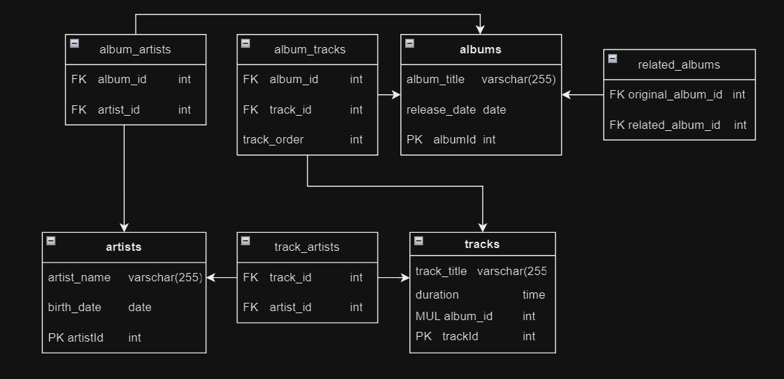

# SchoolAzure

## Frontend Usage [https://github.com/Kemixd3/KEA_Azure_Frontend/tree/preprod]

Visit the Azure page [https://kemixd3.github.io/KEA_Azure_Frontend/] to check out the frontend code.

### List of Artists

Sort and filter by selecting the desired data:

1. Search for artists, albums, and tracks.
2. Search for artists.
3. Search for albums by a specific artist.

Enter your query in the search bar and click "Search."

## E/R Diagram of Database Relations

## Backend Usage [https://github.com/Kemixd3/SchoolAzure/tree/preprod]

### Endpoints for Managing Albums

- **GET /albums:** Retrieve a list of all albums.
- **POST /albums:** Create a new album by providing `album_title` and `release_date`.
- **PUT /albums/:albumId:** Update an album's information by specifying its `albumId`.
- **DELETE /albums/:albumId:** Delete an album by providing its `albumId`.
- **SEARCH /search/albums:** Search for albums by `album_name`.

### Endpoints for Managing Artists

- **GET /artists:** Retrieve a list of all artists.
- **POST /artists:** Create a new artist by providing `artist_name` and `birth_date`.
- **PUT /artists/:artistId:** Update an artist's information by specifying their `artistId`.
- **DELETE /artists/:artistId:** Delete an artist by providing their `artistId`.
- **SEARCH /search/artist:** Search for artists by `artist_name`.

### Endpoints for Managing Tracks

- **GET /tracks:** Retrieve a list of all tracks.
- **POST /tracks:** Create a new track by providing `track_title`, `duration`, and `album_id`.
- **PUT /tracks/:trackId:** Update a track's information by specifying its `trackId`.
- **DELETE /tracks/:trackId:** Delete a track by providing its `trackId`.
- **SEARCH /search/tracks:** Search for tracks by `track_name`.

### General Search

- **GET /search/searchAll:** Perform a global search across all entities (tracks, artists, and albums) by providing a `search_word`.

### Complete Album

- **POST /albums_and_songs:** Create a new album along with its associated songs. Provide `album_title`, `release_date`, and an array of `songs` containing `track_title` and `duration`.

Ensure that the backend server is up and running on the specified port (default is 3000).

### By Nikolai Berthelsen and Silas Sandager
